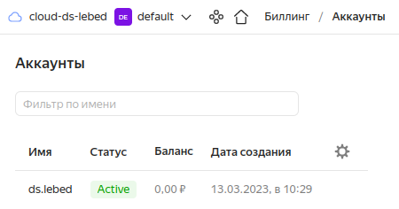
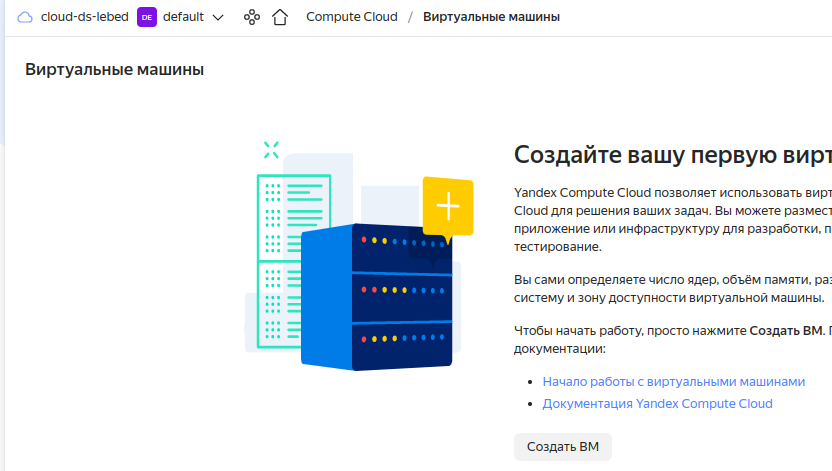
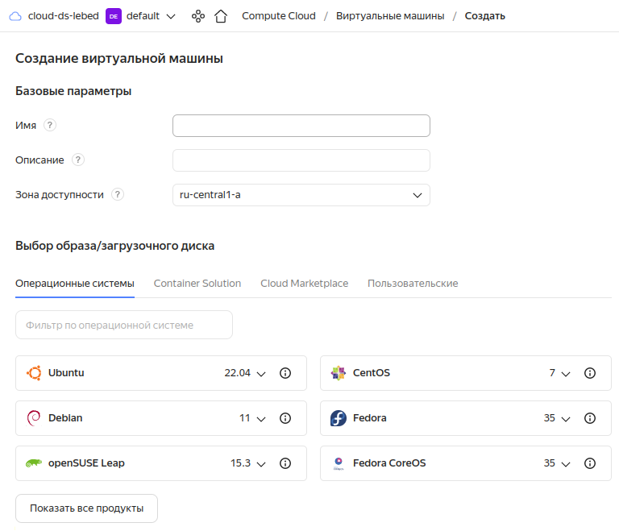
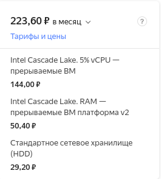
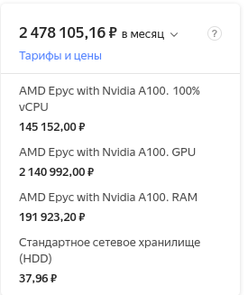
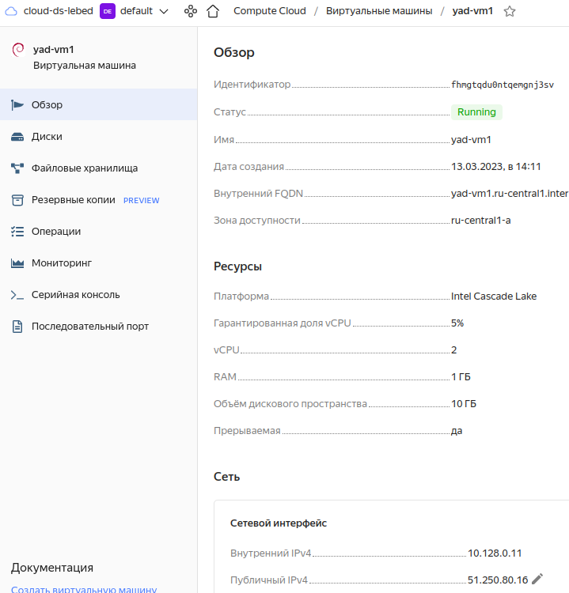
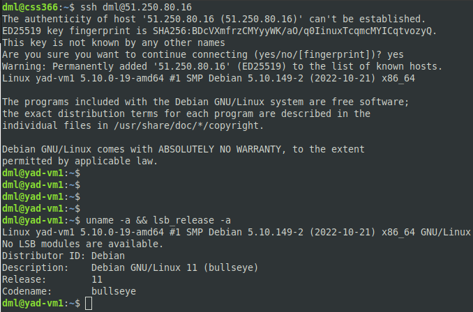

# Виртуализация и облачные решения. AWS, GCP, Яндекс.Облако, Openstack - Лебедев Д.С.

## Задание 1.
> Ответьте на вопрос в свободной форме.
> Чем частное облако отличается от общедоступного, публичного и гибридного?

*Ответ:*  
Частное облако доступно, как правило, одной компании, которой оно и принадлежит. Эта компания отвечает за работоспособность облака. Преимуществом частного облака будет высокая безопасность. Из минусов, потребуются собственные IT-специалисты для управления облаком. Публичные и гибридные могут использоваться несколькими компаниями одновременно.

## Задание 2
> Что обозначают: IaaS, PaaS, SaaS, CaaS, DRaaS, BaaS, DBaaS, MaaS, DaaS, NaaS, STaaS? Напишите примеры их использования.

*Ответ:*  
- IaaS - инфраструктура как сервис. Предоставление непосредственно серверного "железа" клиенту. Примеры - пул готовых виртуальных ресурсов публичные облака (Elastic Cloud), сервисы гиперскейлеров - виртуальные машины Microsoft Azure, виртуальные серверы Amazon EC2 и т.д.;
- PaaS - платформа как сервис. Предоставление платформы клиенту, например, управление СУБД. Пример - платформы для разработки приложений в контейнерах - Containerum Managed Kubernetes Service;
- SaaS - софт как сервис. Предоставление набора ПО клиенту. Примеры - Gmail, DropBox.
- CaaS - коммуникация как сервис. Пример - предоставление услуг корпоративной связи.
- DRaaS - аварийной восстановление как сервис. Создние копий виртуальных серверов на случай полного отказа инфраструктуры.
- BaaS - бэкап как сервис. Предоставление услуги резервного копирования.
- DBaaS - база данных как сервис. Предоставление БД клиенту.
- MaaS - мониторинг как сервис. Предоставление услуги мониторинга инфраструктуры клиента.
- DaaS - рабочий стол как сервис. Предоставление готового рабочего места клиенту.
- NaaS - сеть как сервис. Предоставление сетевых услуг клиенту.
- STaaS - хранение как сервис. Пример - предоставление клиенту ресурсов для хранения данных.

## Задание 3.
> Ответьте на вопрос в свободной форме.
> Напишите, какой вид сервиса предоставляется пользователю в ситуациях:
> 1. Всеми процессами управляет провайдер.
> 2. Вы управляете приложением и данными, остальным управляет провайдер.
> 3. Вы управляете операционной системой, средой исполнения, данными, приложениями, остальными управляет провайдер.
> 4. Вы управляете сетью, хранилищами, серверами, виртуализацией, операционной системой, средой исполнения, данными, приложениями.

*Ответ:*  
1. SaaS;
2. PaaS;
3. IaaS;
4. Локальный, on-site сервис.

## Задание 4
> Вы работаете ИТ-специалистом в своей компании. Перед вами встал вопрос: покупать физический сервер или арендовать облачный сервис от Yandex Cloud.
> 
> Выполните действия и приложите скриншоты по каждому этапу:
> 1. Создать платёжный аккаунт:
> - зайти в консоль;
> - выбрать меню биллинг;
> - зарегистрировать аккаунт.
> 
> 2. После регистрации выбрать меню в консоли Computer cloud.
> 3. Приступить к созданию виртуальной машины.
> 
> **Ответьте на вопросы в свободной форме:**
> 1. Какие ОС можно выбрать?
> 2. Какие параметры сервера можно выбрать?
> 3. Какие компоненты мониторинга можно создать?
> 4. Какие системы безопасности предусмотрены?
> 5. Как меняется цена от выбранных характеристик? Приведите пример самой дорогой и самой дешёвой конфигурации.

*Ответ:*  
1. Создание платёжного аккаунта:  
  

2. Computer cloud:  
  

3. Начало создания ВМ  
  

- На данный момент можно выбрать ОС - Ubuntu, Debian, openSUSE, CentOS, Fedora, FreeBSD, REDOS, Astra, ALT, Роса и т.д. разных версий;
- Параметры сервера - процессор и количество ядер, объем оперативной памяти, количество, тип и объем дисковых накопителей, сетевые адаптеры, их количество и настройки. Можно так же выбирать гарантированную долю vCPU, которая будет выделена ВМ;
- Через Агент сбора метрик можно отслеживать системные метрики ВМ, а так же метрики пользовательских приложений;
- Защита от DDoS-атак;
- [Цена зависит от используемых ресурсов](https://cloud.yandex.ru/docs/compute/pricing#prices), от 200 рублей и до миллионов.  
  

## Задание 5*
> Выполните действия и приложите скриншот:
> 1. Создайте виртуальную машину на Yandex Cloud.
> 2. Создайте сервисный аккаунт.
> 3. Отсканируйте SSH-ключ.
> 4. Придумайте логин.
> 5. Подключитесь к облаку через SSH.

*Ответ:*  
  
