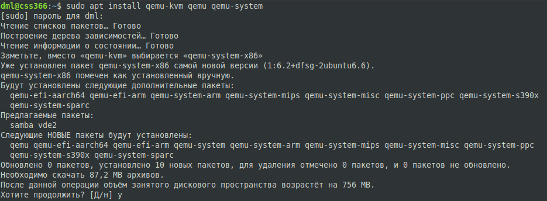
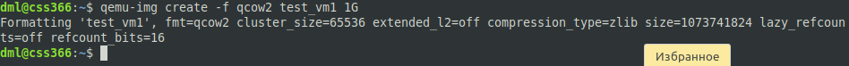
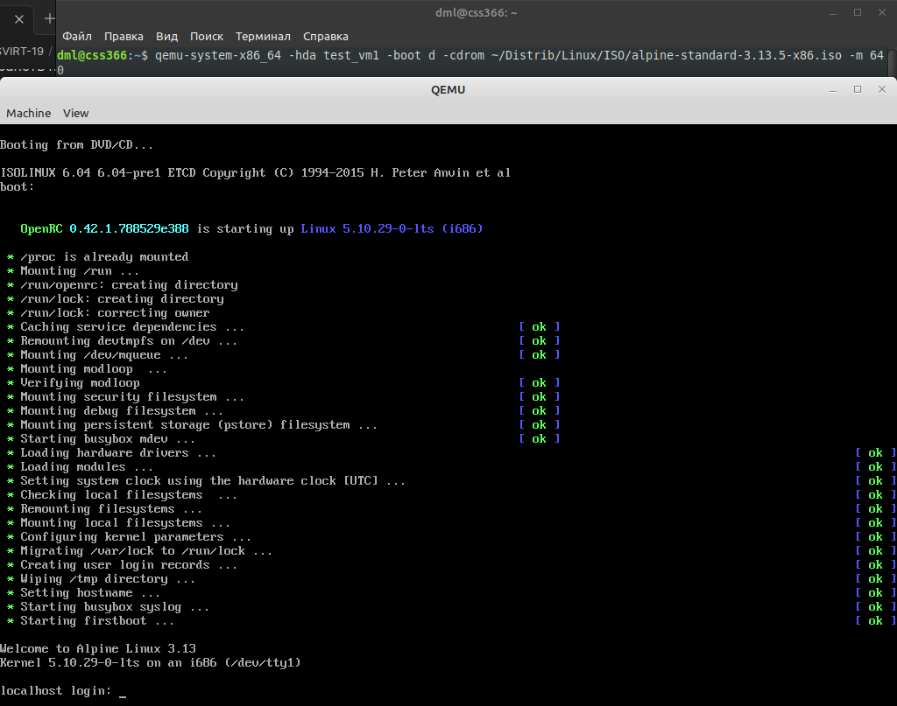
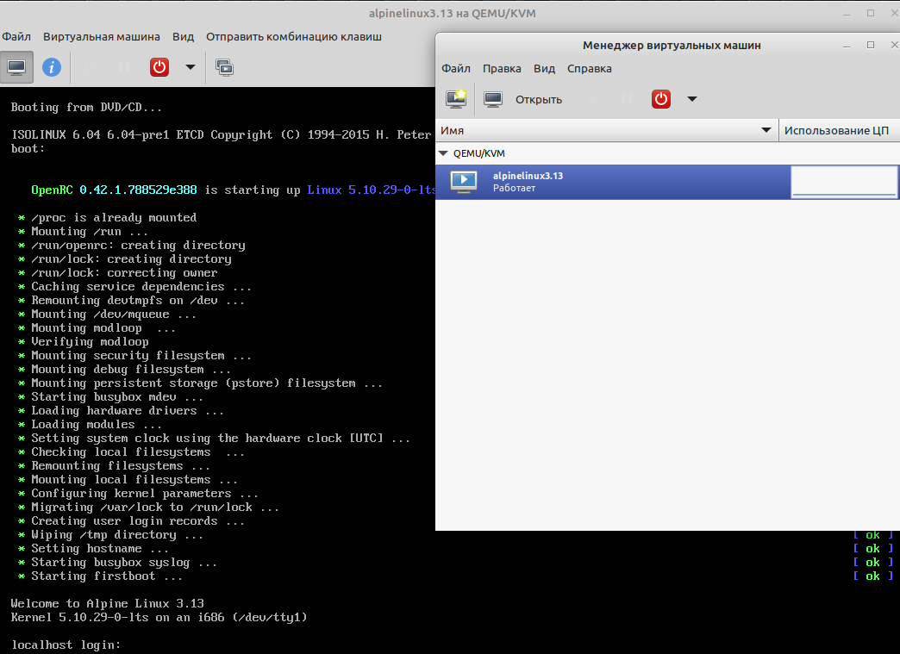
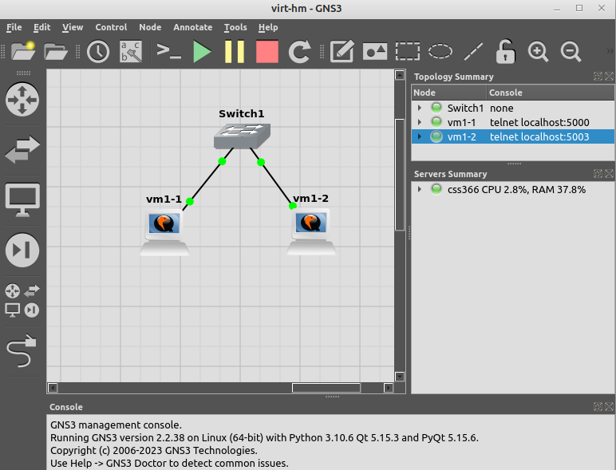

# Типы виртуализации KVM, QEMU - Лебедев Д.С.

## Задание 1.
> Ответьте на вопрос в свободной форме.
> Какие виртуализации существуют? Приведите примеры продуктов разных типов виртуализации.

*Ответ:*  
- Аппаратная - работает благодаря поддержке со стороны процессора. На чипе Intel реализована в HT, VT-x, VT-d, VMDQ. На чипе AMD - AMD-V. На чипе ARM -EL2;
- Программная - эмулирует все железо от процессора до сетевого адаптера. Пример: KVM, QEMU, VirtualBox, XEN, HYPER-V;
- Контейнерная - эмулирует несколько изолированных пространств пользователя. Виртуальная среда запускается из ядра хостовой операционной системы. Пример: Docker, Kubernetes;
- Хостинговая - эмулирует железо в облаке. Пример: AWS, GCP, Яндекс и т.д.;


## Задание 2.
> Выполните действия и приложите скриншоты по каждому этапу:
> 1. Установите QEMU в зависимости от системы (в лекции рассматривались примеры).
> 2. Создайте виртуальную машину.
> 3. Установите виртуальную машину. Можете использовать пример по [ссылке](https://dl-cdn.alpinelinux.org/alpine/v3.13/releases/x86/alpine-standard-3.13.5-x86.iso).
> Пример взят [с сайта](https://alpinelinux.org/).

*Ответ:*  

```sh
sudo apt install qemu-kvm qemu qemu-system
```

  

```sh
qemu-img create -f qcow2 test_vm1 1G
```

  

```sh
qemu-system-x86_64 -hda test_vm1 -boot d -cdrom ~/Distrib/Linux/ISO/alpine-standard-3.13.5-x86.iso -m 640
```

  

## Задание 3.
> Выполните действия и приложите скриншоты по каждому этапу:
> 1. Установите KVM и библиотеку libvirt. Можете использовать GUI-версию из лекции.
> 2. Создайте виртуальную машину.
> 3. Установите виртуальную машину. Можете использовать пример [по ссылке](https://dl-cdn.alpinelinux.org/alpine/v3.13/releases/x86/alpine-standard-3.13.5-x86.iso).
> Пример взят [с сайта](https://alpinelinux.org/).

*Ответ:*  
```sh
sudo apt install qemu qemu-kvm libvirt-daemon libvirt-daemon-system libvirt-clients virtinst virt-manager
```

****  


## Задание 4.
> Выполните действия и приложите скриншоты по каждому этапу:
> 1. Создайте проект в GNS3, предварительно установив [GNS3](https://github.com/GNS3/gns3-gui/releases).
> 2. Создайте топологию, как на скрине ниже.
> 3. Для реализации используйте машину на базе QEMU. Можно дублировать, сделанную ранее.  
> 

*Ответ:*  
```sh
sudo add-apt-repository ppa:gns3/ppa
sudo apt install gns3-server gns3-gui
```

