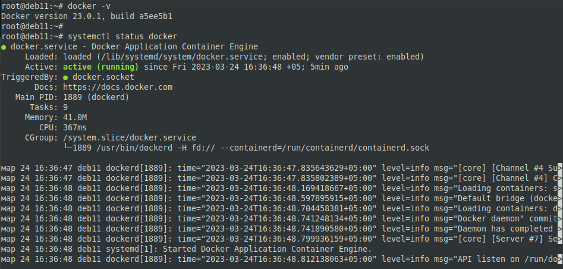
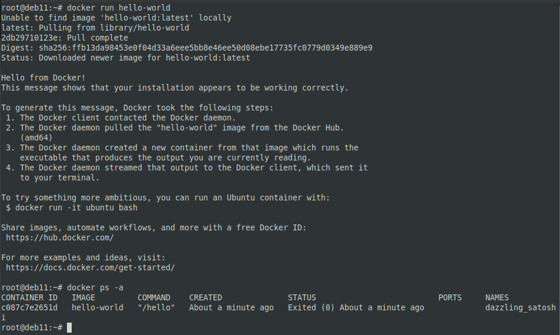
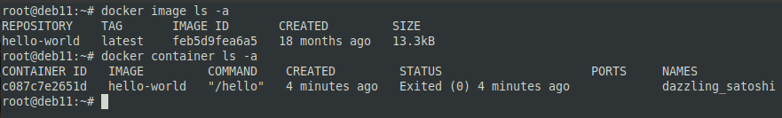
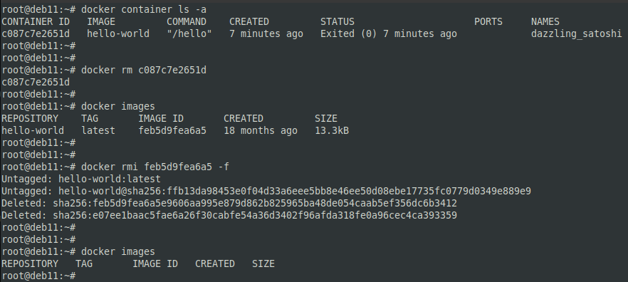
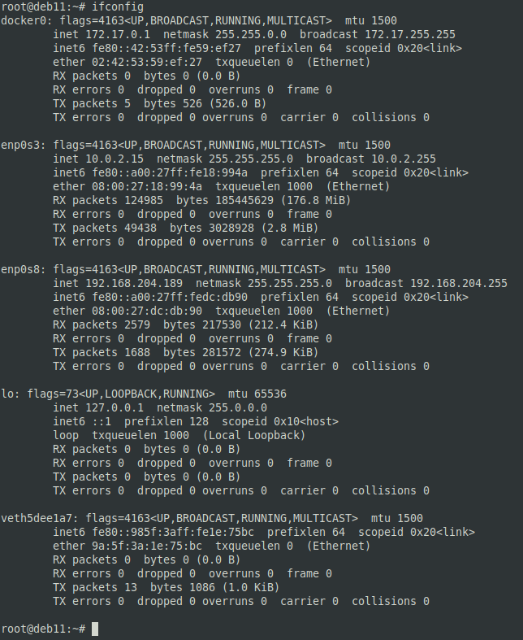
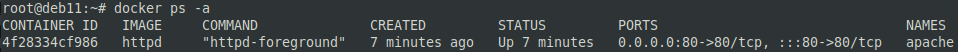
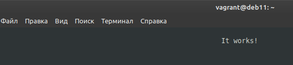
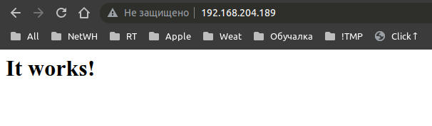
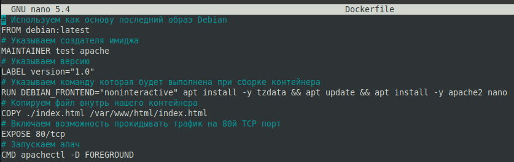
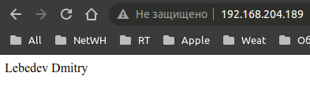

# Docker, часть 1 - Лебедев Д.С.

## Задание 1.
> Ответьте на вопрос в свободной форме.
> Чем контейнеризация отличается от виртуализации?

*Ответ:*  
При виртуализации каждая виртуальная машина разделяет аппаратные ресурсы и имеет клон операционной системы. Контейнеры используют общую операционную систему.

## Задание 2.
> Выполните действия:
> 1. Установите Docker.
> 2. Приложите скриншот.

*Ответ:*  
https://docs.docker.com/engine/install/debian/
```sh
sudo apt update
sudo apt install apt-transport-https ca-certificates curl gnupg lsb-release

curl -fsSL https://download.docker.com/linux/debian/gpg | sudo gpg --dearmor -o/usr/share/keyrings/docker-archive-keyring.gpg

echo "deb [arch=amd64 signed-by=/usr/share/keyrings/docker-archive-keyring.gpg] https://download.docker.com/linux/debian $(lsb_release -cs) stable" | sudo tee /etc/apt/sources.list.d/docker.list > /dev/null

sudo apt update
sudo apt install docker-ce docker-ce-cli containerd.io
sudo systemctl enable docker
sudo systemctl start docker

docker -v
systemctl status docker
```



## Задание 3.
> Выполните действия:
> 1. Запустите образ hello-world.
> 2. Приложите скриншот.

*Ответ:*  
```sh
docker run hello-world
docker ps -a
```

  

  

## Задание 4.
> Выполните действия:
> 1. Удалите образ hello-world.
> 2. Приложите скриншот.

*Ответ:*  
```sh
docker container ls -a
docker rm ...

docker images
docker rmi ... -f
```



## Задание 5*
> 1. Найдите в Docker Hub образ apache и установите его.
> 2. Приложите:
> - скриншоты сетевых настроек вашей виртуальной машины;
> - скриншоты работающих контейнеров;
> - скриншот браузера, где вы открыли дефолтную страницу вашего apache внутри контейнера.

*Ответ:*  
```sh
docker pull httpd
docker run -d --name apache -p 80:80 httpd
```

  
  

```sh
apt install links
links http://localhost:80
```

  



## Задание 6*
> 1. Создайте свой Docker образ с Apache2 и подмените стандартную страницу index.html на страницу, содержащую ваши ФИО.
> 2. Приложите:
> - скриншот содержимого Dockerfile;
> - скриншот браузера, где apache2 из вашего контейнера выводит ваши ФИО.

*Ответ:*  
```sh
nano Dockerfile
nano index.html

docker build -t apache_test_80:1.0 .
docker images
docker run -d -p 80:80 ...
```

  

