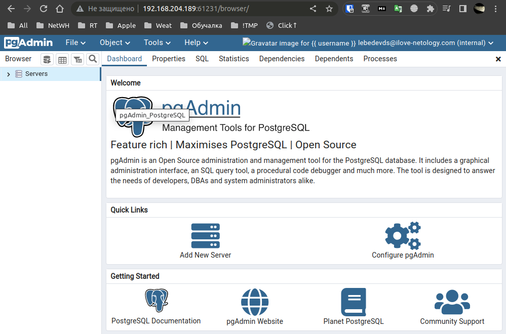
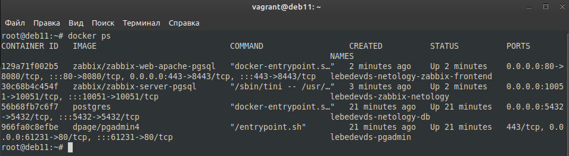
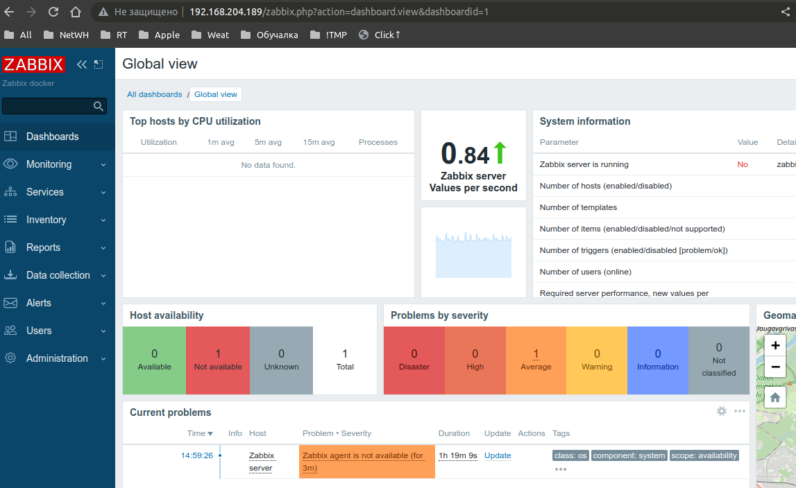
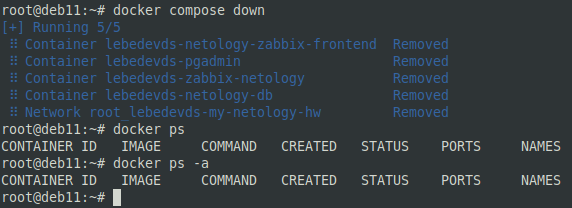

# Docker, часть 2 - Лебедев Д.С.

## Задание 1.
> Напишите ответ в свободной форме, не больше одного абзаца текста.  
> Установите Docker Compose и опишите, для чего он нужен и как может улучшить вашу жизнь.

*Ответ:*  
Docker Compose - средство, входящее в состав Docker. Разработано для использования многоконтейнерных приложений. Позволяет значительно облегчить развертывание/администрирование многоконтейнерной архитектуры в пределах одной ноды.

## Задание 2.
> Выполните действия и приложите текст конфига на этом этапе.  
> Создайте файл docker-compose.yml и внесите туда первичные настройки:
> - version;
> - services;
> - networks.
> При выполнении задания используйте подсеть 172.22.0.0. Ваша подсеть должна называться: <ваши фамилия и инициалы>-my-netology-hw.

*Ответ:*  

```sh
version: "3"
services:

networks:
  lebedevds-my-netology-hw:
    driver: bridge
    ipam:
      config:
      - subnet: 172.22.0.0/24
```

## Задание 3.
> Выполните действия и приложите текст конфига текущего сервиса:
> 1. Установите PostgreSQL с именем контейнера <ваши фамилия и инициалы>-netology-db.
> 2. Предсоздайте БД <ваши фамилия и инициалы>-db.
> 3. Задайте пароль пользователя postgres, как <ваши фамилия и инициалы>12!3!!
> 4. Пример названия контейнера: ivanovii-netology-db.
> 5. Назначьте для данного контейнера статический IP из подсети 172.22.0.0/24.

*Ответ:*  
```sh
  netology-db:
    image: postgres
    container_name: lebedevds-netology-db
    ports:
      - 5432:5432
    volumes:
      - ./pg_data:/var/lib/postgresql/data/pgdata
    environment:
      POSTGRES_PASSWORD: lebedevds12!3!!
      POSTGRES_DB: lebedevds-db
      PGDATA: /var/lib/postgresql/data/pgdata
    networks:
      lebedevds-my-netology-hw:
        ipv4_address: 172.22.0.2
    restart: always
```


## Задание 4.
> Выполните действия:
> 1. Установите pgAdmin с именем контейнера <ваши фамилия и инициалы>-pgadmin.
> 2. Задайте логин администратора pgAdmin <ваши фамилия и инициалы>@ilove-netology.com и пароль на выбор.
> 3. Назначьте для данного контейнера статический IP из подсети 172.22.0.0/24.
> 4. Прокиньте на 80 порт контейнера порт 61231.
> В качестве решения приложите:
> - текст конфига текущего сервиса;
> - скриншот админки pgAdmin.

*Ответ:*  
```sh
  pgadmin:
    image: dpage/pgadmin4
    container_name: lebedevds-pgadmin
    environment:
      PGADMIN_DEFAULT_EMAIL: lebedevds@ilove-netology.com
      PGADMIN_DEFAULT_PASSWORD: 123
    ports:
      - "61231:80"
    networks:
      lebedevds-my-netology-hw:
        ipv4_address: 172.22.0.3
    restart: always
```




## Задание 5.
> Выполните действия и приложите текст конфига текущего сервиса:
> 1. Установите Zabbix Server с именем контейнера <ваши фамилия и инициалы>-zabbix-netology.
> 2. Настройте его подключение к вашему СУБД.
> 3. Назначьте для данного контейнера статический IP из подсети 172.22.0.0/24.

*Ответ:*  
```sh
  zabbix-server:
    image: zabbix/zabbix-server-pgsql
    links:
      - netology-db
    container_name: lebedevds-zabbix-netology
    environment:
      DB_SERVER_HOST: '172.22.0.2'
      POSTGRES_USER: postgres
      POSTGRES_PASSWORD: lebedevds12!3!!
    ports:
      - "10051:10051"
    networks:
      lebedevds-my-netology-hw:
        ipv4_address: 172.22.0.4
    restart: always
```

## Задание 6.
> Выполните действия и приложите текст конфига текущего сервиса:
> 1. Установите Zabbix Frontend с именем контейнера <ваши фамилия и инициалы>-netology-zabbix-frontend.
> 2. Настройте его подключение к вашему СУБД.
> 3. Назначьте для данного контейнера статический IP из подсети 172.22.0.0/24.

*Ответ:*  
 ```sh
 zabbix_wgui:
    image: zabbix/zabbix-web-apache-pgsql
    links:
      - netology-db
      - zabbix-server
    container_name: lebedevds-netology-zabbix-frontend
    environment:
      DB_SERVER_HOST: '172.22.0.2'
      POSTGRES_USER: 'postgres'
      POSTGRES_PASSWORD: lebedevds12!3!!
      ZBX_SERVER_HOST: "zabbix_wgui"
      PHP_TZ: "Asia/Yekaterinburg"
    ports:
      - "80:8080"
      - "443:8443"
    networks:
      lebedevds-my-netology-hw:
        ipv4_address: 172.22.0.5
    restart: always
```

## Задание 7.
> Выполните действия.  
> Настройте линки, чтобы контейнеры запускались только в момент, когда запущены контейнеры, от которых они зависят.  
> В качестве решения приложите:
> - текст конфига целиком;
> - скриншот команды docker ps;
> - скриншот авторизации в админке Zabbix.

*Ответ:*  
[YML файл](_attachments/06.04-docker-compose.yml)





## Задание 8.
> Выполните действия:
> 1. Убейте все контейнеры и потом удалите их.
> 2. Приложите скриншот консоли с проделанными действиями.

*Ответ:*  


## Задание 9*
> Запустите свой сценарий на чистом железе без предзагруженных образов.  
> Ответьте на вопросы в свободной форме:
> 1. Сколько ушло времени на то, чтобы развернуть на чистом железе написанный вами сценарий?
> 2. Чем вы занимались в процессе создания сценария так, как это видите вы?
> 3. Что бы вы улучшили в сценарии развёртывания?

*Ответ:*  
1. На чистом железе на установку Docker ушло 3 минуты, на развертывание сценария - 1 минута (ВМ 2 ядра, 4 Гб ОЗУ).
2. Занимался составлением сценария под свои нужды, добавлением сервисов в конфиг, пробросом портов и директорий.
3. Не стал бы скачивать последние версии образов сервисов (:latest), вероятно, указал бы определённые, для более стабильной работы.