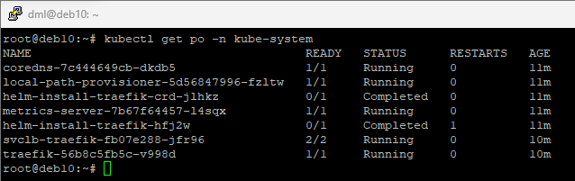
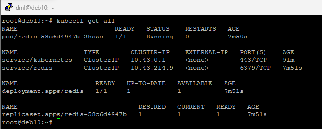

# 06.05. Kubernetes, часть 1 - Лебедев Д.С.

## Задание 1.
> Выполните действия:
> 1. Запустите Kubernetes локально, используя k3s или minikube на свой выбор.
> 2. Добейтесь стабильной работы всех системных контейнеров.
> 3. В качестве ответа пришлите скриншот результата выполнения команды kubectl get po -n kube-system.

*Ответ:*  
```sh
apt install curl
curl -sfL https://get.k3s.io | sh -
kubectl get po -n kube-system
```



## Задание 2.
> Есть файл с деплоем:  
```sh
---
apiVersion: apps/v1
kind: Deployment
metadata:
  name: redis
spec:
  selector:
    matchLabels:
      app: redis
  replicas: 1
  template:
    metadata:
      labels:
        app: redis
    spec:
      containers:
      - name: master
        image: bitnami/redis
        env:
         - name: REDIS_PASSWORD
           value: password123
        ports:
        - containerPort: 6379
```  
> Выполните действия:
> 1. Измените файл с учётом условий:
>  - redis должен запускаться без пароля;
>  - создайте Service, который будет направлять трафик на этот Deployment;
>  - версия образа redis должна быть зафиксирована на 6.0.13.
> 2. Запустите Deployment в своём кластере и добейтесь его стабильной работы.
> 3. В качестве решения пришлите получившийся файл.

*Ответ:*  
```sh
nano redis.yaml
kubectl apply -f redis.yaml
kubectl get all
kubectl get po
```

```yaml
---
apiVersion: apps/v1
kind: Deployment
metadata:
  name: redis
spec:
  selector:
    matchLabels:
      app: redis
  replicas: 1
  template:
    metadata:
      labels:
        app: redis
    spec:
      containers:
      - name: master
        image: bitnami/redis:6.0.13
        env:
         - name: ALLOW_EMPTY_PASSWORD
           value: "yes"
        ports:
         - containerPort: 6379

---
apiVersion: v1
kind: Service
metadata:
  name: redis
spec:
  selector:
    app: redis
  ports:
    - protocol: TCP
      port: 6379
      targetPort: 6379
```



## Задание 3.
> Выполните действия:
> 1. Напишите команды kubectl для контейнера из предыдущего задания:
> - выполнения команды ps aux внутри контейнера;
> - просмотра логов контейнера за последние 5 минут;
> - удаления контейнера;
> - проброса порта локальной машины в контейнер для отладки.
> 2. В качестве решения пришлите получившиеся команды.

*Ответ:*  
```sh
kubectl exec -it pod/redis-58c6d4947b-2hszs -- ps aux
kubectl logs --since=5m redis-58c6d4947b-2hszs
kubectl delete pod/redis-58c6d4947b-2hszs
kubectl port-forward redis-58c6d4947b-kssdn 12345:80
```
