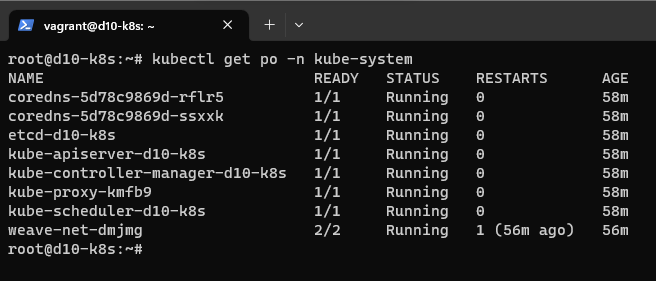
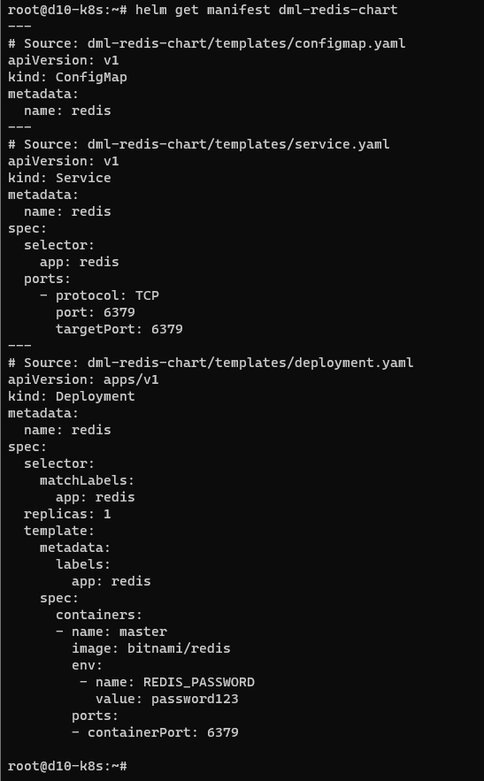

# 06.06. Kubernetes, часть 2 - Лебедев Д.С.

### Задание 1.
> **Выполните действия:**
> 1.  Создайте свой кластер с помощью kubeadm.
> 2.  Установите любой понравившийся CNI плагин.
> 3.  Добейтесь стабильной работы кластера.
> В качестве ответа пришлите скриншот результата выполнения команды `kubectl get po -n kube-system`.

*Ответ:*  

### Задание 2.
> Есть файл с деплоем:
> ...
> **Выполните действия:**
> 1.  Создайте Helm Charts.
> 2.  Добавьте в него сервис.
> 3.  Вынесите все нужные, на ваш взгляд, параметры в `values.yaml`.
> 4.  Запустите чарт в своём кластере и добейтесь его стабильной работы.
> В качестве ответа пришлите вывод команды `helm get manifest <имя_релиза>`.

*Ответ:*  
